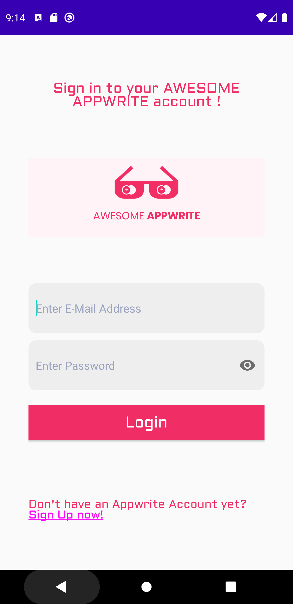
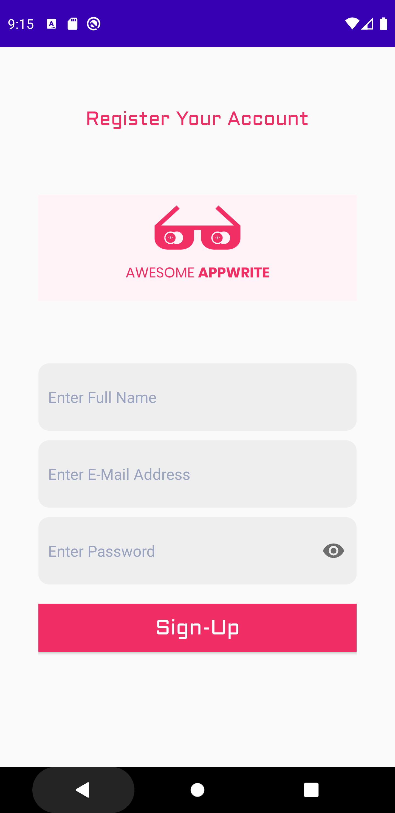

# Appwrite Playground for Android with Retrofit

This is a playground demo app for Android with Retrofit. We are using direct HTTP request for using Appwrite functionalities within android framework.

               

---
## Features!

  - Login 
  - Register an account with Appwrite
  - Logout a user from current device
  - Logout a user from all devices
  - Persistent Cookie
  - **More features coming soon**
  ---
## System Requirements 
* JDK 9+
* Latest version of Android Studio.
* Make sure android studio is installed and that your android environment is set for running android projects.
* You have a project created in AppWrite using console and note down the project ID.

### Installation
1. clone this repository.
2. Open project in android studio.
3. Open  app/src/main/java/com/mainsm/appwritePlusAndroid/utils/Constant.java file.
4. Update PROJECT_ID with the one you have noted above.
5. Click Run 'app' from Run Menu to execute the project. 

---
## Contributing

All code contributions - including those of people having commit access - must go through a pull request and approved by a core developer before being merged. This is to ensure proper review of all the code.

We truly ❤️ pull requests! If you wish to help, you can learn more about how you can contribute to this project in the [contribution guide]([CONTRIBUTING.md](https://github.com/appwrite/appwrite/blob/master/CONTRIBUTING.md)).

Markdown is a lightweight markup language based on the formatting conventions that people naturally use in email.  As [John Gruber] writes on the [Markdown site][df1]

## Security

For security issues, kindly email us [security@appwrite.io](mailto:security@appwrite.io) instead of posting a public issue in GitHub.

## Follow Us
Join our growing community around the world! Follow us on [Twitter](https://twitter.com/appwrite_io), [Facebook Page](https://www.facebook.com/appwrite.io), [Facebook Group](https://www.facebook.com/groups/appwrite.developers/) or join our Discord Server [Discord community](https://discord.gg/GSeTUeA) for more help, ideas and discussions.  

***
# This Repository Created By :
 
 **Subhav Mathur**
 
 [Visit Linkedin](https://www.linkedin.com/in/subhav-mathur-9790a536/ "Subhav Mathur's Profile")
***

## Todos
- Add almost all the API functionalities provided by Appwrite.io

  
